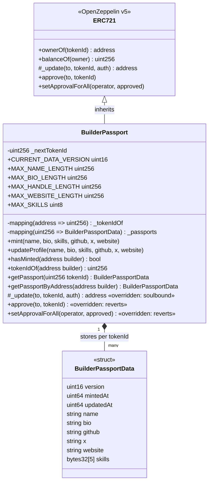
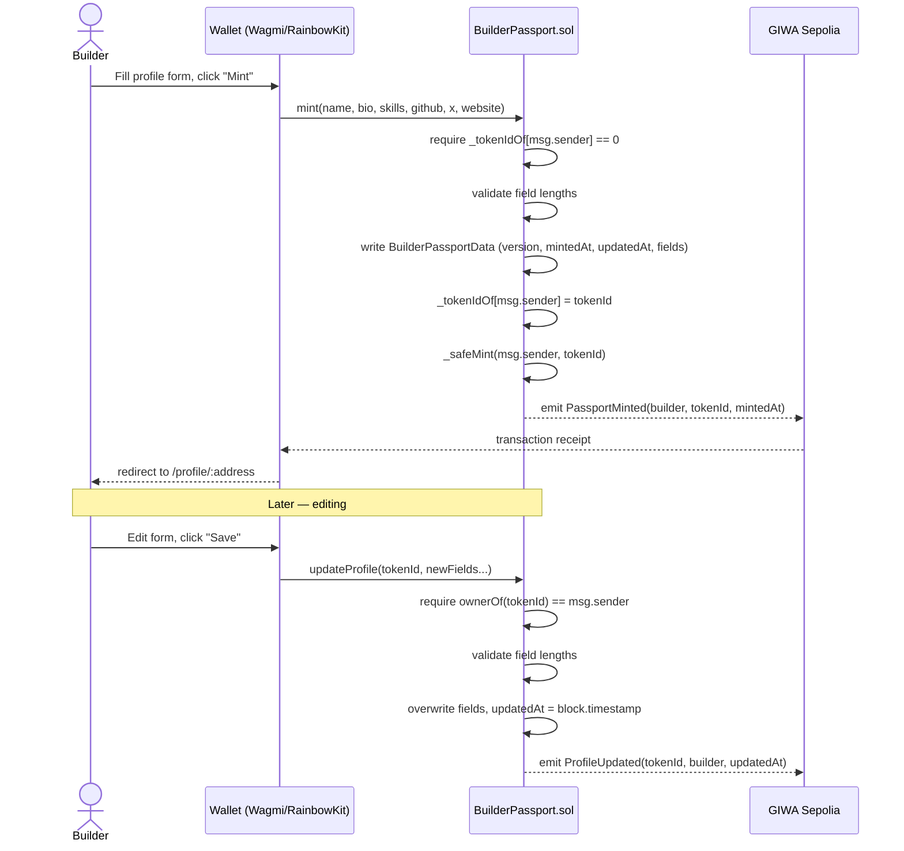
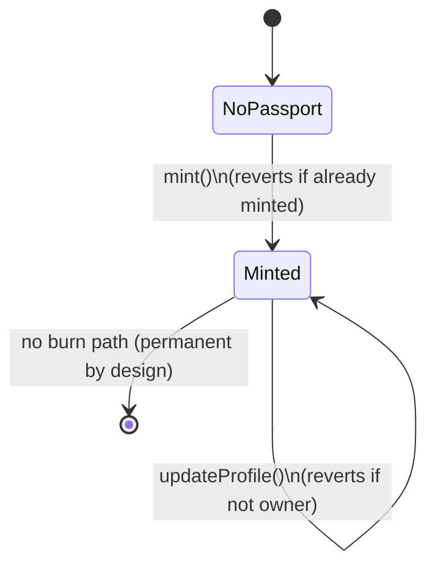

# BuilderPassport.sol — Design Review (pre-implementation)

Status: **approved and implemented** (Milestone 2). This document remains the
source-of-truth design rationale for `BuilderPassport.sol` — every diagram,
storage-layout decision, and attack-vector item below matches the shipped
contract. The four open decisions in §8 were resolved as: `bytes32[5]` skills
(confirmed), field caps of name 64 / bio 280 / handle 64 / **website 256**
(bumped from the original 128 proposal), no burn function (confirmed), no
admin/`Ownable` role (confirmed) — plus one addition: `CONTRACT_VERSION =
"1.0.0"` as an informational constant, not used in on-chain logic.

Target: Solidity `0.8.30`, OpenZeppelin Contracts `v5.x`.

---

## 1. Architectural improvements applied in this pass

Beyond the three decisions already locked in (on-chain struct, soulbound,
`version` field), this design pass adds the following — flagging each as a
choice you should explicitly sign off on, not a silent addition:

1. **Custom errors instead of `require(string)`** — cheaper (no string
   storage/copy cost) and more precise for clients to catch.
2. **Packed value-type slot** — `version` (`uint16`) + `mintedAt` (`uint64`) +
   `updatedAt` (`uint64`) are declared contiguously so Solidity packs them
   into a single 32-byte storage slot instead of three, cutting 2 SSTORE
   operations off every mint.
3. **`skills` as `bytes32[5]` instead of `string[]`** — a fixed-size array of
   `bytes32` avoids the dynamic-array length slot and keccak-addressed data
   slots that a `string[]` requires. Trade-off: each skill is capped at 32
   ASCII bytes (fine for tags like "Solidity", "Rust", "React"; not fine for
   sentences — this is a UX constraint you should confirm you're OK with).
4. **`updatedAt` added** alongside `mintedAt` — lets a profile update be
   distinguished from the original mint without an indexer, using only the
   struct itself.
5. **`approve` / `setApprovalForAll` overridden to revert** — for a soulbound
   token, letting approvals succeed while transfers always fail is
   semantically confusing (a marketplace could list it, a buyer could "buy"
   and have the tx revert). Blocking approvals at the source closes that off
   and saves the wasted gas of an approval that could never be exercised.
6. **No burn function** — a passport, once minted, is permanent. This
   matches the "proof of early builder" positioning; if you want a
   right-to-be-forgotten style burn later, that's a deliberate future
   decision, not a default (see §6, Open Decisions).
7. **No admin/`Ownable` role** — there is no privileged function in MVP
   scope, so no owner key exists to be a target. If a future schema
   migration needs an admin-gated function, `Ownable` gets added
   deliberately at that point, not preemptively.
8. **`_safeMint` used, but only after all state is written** — see §5,
   reentrancy analysis.

---

## 2. UML — Contract Structure



---

## 3. Storage Layout

### Slot-level layout of `BuilderPassportData` (per tokenId)

| Field | Type | Slot | Notes |
|---|---|---|---|
| `version` | `uint16` | 0 (packed) | Schema version; `CURRENT_DATA_VERSION` at mint time |
| `mintedAt` | `uint64` | 0 (packed) | Immutable after mint |
| `updatedAt` | `uint64` | 0 (packed) | Set = `mintedAt` at mint, refreshed on each update |
| *(112 bits unused in slot 0)* | — | 0 | Headroom for a future small field without a new slot |
| `name` | `string` | 1 (+ data slots) | Dynamic — length-dependent extra slots |
| `bio` | `string` | 2 (+ data slots) | Dynamic |
| `github` | `string` | 3 (+ data slots) | Dynamic |
| `x` | `string` | 4 (+ data slots) | Dynamic |
| `website` | `string` | 5 (+ data slots) | Dynamic |
| `skills` | `bytes32[5]` | 6–10 | Fixed array, one slot per element, always 5 slots regardless of fill |

### Contract-level storage variables

| Variable | Type | Why it exists |
|---|---|---|
| `_tokenIdOf` | `mapping(address => uint256)` | Enforces one-passport-per-wallet. `0` means "no passport" — this is why token IDs start at `1`, not `0`: it keeps `0` a safe sentinel for "doesn't exist" without an extra `exists` bool. |
| `_passports` | `mapping(uint256 => BuilderPassportData)` | The actual profile data, keyed by tokenId rather than address, so it composes naturally with standard ERC-721 tooling (`ownerOf`, `tokenId`-based explorers) while `_tokenIdOf` gives the reverse lookup. |
| `_nextTokenId` | `uint256` | Monotonic counter for the next tokenId to mint, starting at `1`. Simpler and cheaper than tracking total supply separately — `_nextTokenId - 1` is the supply. |
| `CURRENT_DATA_VERSION` | `uint16` constant | The schema version stamped into every new passport's `version` field. Doesn't cost storage (constants are inlined into bytecode). |
| `MAX_NAME_LENGTH`, `MAX_BIO_LENGTH`, `MAX_HANDLE_LENGTH`, `MAX_WEBSITE_LENGTH`, `MAX_SKILLS` | constants | Bound every user-controlled string/array so gas cost per mint/update is predictable and an attacker can't grief storage with unbounded input. Values proposed: name 64, bio 280, github/x handle 64, website 128 bytes, max 5 skills — flag if you want different limits. |

Inherited from OpenZeppelin `ERC721` (not modified, listed for completeness):
`_owners` (tokenId→owner), `_balances` (owner→count), `_tokenApprovals`,
`_operatorApprovals` — the latter two remain unused in practice since
`approve`/`setApprovalForAll` are overridden to revert, but they still exist
in storage layout because we inherit the standard implementation rather than
forking it (keeps us compatible with every wallet/explorer's ERC-721
expectations).

---

## 4. Event Flow



**Events:**
```solidity
event PassportMinted(address indexed builder, uint256 indexed tokenId, uint64 mintedAt);
event ProfileUpdated(uint256 indexed tokenId, address indexed builder, uint64 updatedAt);
```
Kept deliberately minimal (no string fields indexed/emitted) — indexing a
`string` is expensive and only stores its hash anyway, which isn't useful
here since the full data is already cheaply readable via `getPassport()`.
Any frontend or indexer just needs to know *that* something changed and for
*whom*; it re-reads the struct for the actual content.

---

## 5. State Diagram (per wallet)



There is intentionally no transition back to `NoPassport` — no burn, no
transfer. A wallet's state is a one-way door: `NoPassport → Minted`, and it
stays `Minted` forever, only ever mutating its data via `updateProfile`.

---

## 6. Gas Estimates

These are **estimates from EVM cost fundamentals**, not measured yet — Milestone 2 includes a Hardhat gas-reporter run against the real contract to replace these with measured numbers.

**Cost model used:** cold SSTORE (zero→nonzero) ≈ 22,100 gas (20,000 base +
2,100 cold-slot access under EIP-2929); warm SSTORE (nonzero→nonzero) ≈
2,900–5,000 gas depending on refund/rewrite specifics; `_safeMint`'s
`onERC721Received` check on an EOA recipient costs ~0 extra (skipped for
non-contract addresses).

| Operation | Slots written (approx.) | Estimated gas |
|---|---|---|
| **Mint** (typical: short name/bio, 2–3 skills filled, github+x+website set) | Packed slot (1) + name/bio/github/x/website (5, assuming each ≤31 bytes so no extra data slots) + skills (2–3 nonzero + 2–3 zero-skip) + `_tokenIdOf` mapping (1) + ERC721 `_owners`/`_balances` (2) | **~180,000–220,000 gas** |
| **Mint** (all fields maxed near length caps, all 5 skills filled) | Same as above but name/bio/website may spill into 2nd data slot each | **~230,000–280,000 gas** |
| **Profile update** (all fields already existed, similar lengths) | Warm rewrites only — packed slot's `updatedAt`, plus each changed string/skill slot | **~60,000–110,000 gas** |
| **Profile update** (string length grows past a 32-byte boundary) | Adds new data slot(s), closer to cold-write cost for the new portion | **~90,000–150,000 gas** |

L2-specific note: GIWA is an OP Stack rollup, so total cost = L2 execution
gas (above) + an L1 data-availability fee for the calldata posted to Ethereum
Sepolia. That L1 fee is calldata-size-dependent and outside this contract's
control — it means keeping input strings *short* has a real cost benefit
beyond L2 gas alone, reinforcing the length caps.

---

## 7. Security Review / Attack Vectors

| # | Vector | Assessment | Mitigation |
|---|---|---|---|
| 1 | **Duplicate mint** (same wallet mints twice) | Blocked | `_tokenIdOf[msg.sender] != 0` check, custom error `AlreadyMinted` |
| 2 | **Sybil minting** (one person, many wallets, many passports) | Not preventable on-chain with wallet-only identity | Explicitly out of scope for MVP — accepted limitation, same one every wallet-based identity system has (ENS, POAP, etc. share it). Future reputation layer could add off-chain verification (e.g. GASOK-verified badge) on top. |
| 3 | **Unauthorized profile edit** | Blocked | `updateProfile` requires `ownerOf(tokenId) == msg.sender`, custom error `NotPassportOwner` |
| 4 | **Transfer/sale of a "soulbound" passport** | Blocked | `_update` override reverts whenever both `from` and `to` are nonzero (i.e., anything that isn't a mint) |
| 5 | **Approval-based confusion** (approve succeeds, transfer fails) | Blocked | `approve`/`setApprovalForAll` overridden to revert outright, so no false signal is ever given to marketplaces/indexers |
| 6 | **Reentrancy via `_safeMint`'s `onERC721Received` callback** (if `msg.sender` is a contract wallet) | Low risk, checked | All state (`_tokenIdOf`, `_passports`, packed slot) is written *before* `_safeMint` is called, and `_safeMint` itself updates `_owners`/`_balances` before invoking the callback — so even a malicious receiving contract re-entering `mint()` mid-callback hits the `AlreadyMinted` check and reverts. Checks-effects-interactions is preserved. |
| 7 | **Gas-griefing via oversized input** (huge strings/many skills) | Blocked | All string fields length-capped, `skills` is a fixed-size `bytes32[5]` (can't exceed 5 regardless of input) |
| 8 | **Integer overflow on `_nextTokenId`** | Non-issue | Solidity 0.8.x has built-in checked arithmetic; would require ~2^256 mints, not physically reachable |
| 9 | **`tx.origin` phishing** | N/A | `tx.origin` never used anywhere in the contract |
| 10 | **Malicious/fake `tokenURI` metadata spoofing** | N/A | Contract doesn't use `tokenURI`/off-chain JSON at all — all data is read directly from on-chain struct getters, removing this entire class of risk |
| 11 | **Front-running mint or update** | Negligible | No economic value differs between orderings (no scarce token IDs, no price) — nothing meaningful to front-run |
| 12 | **Storage collision from OZ upgrade** | N/A | No proxy pattern used (immutable contract), so there's no upgrade-storage-layout risk to manage |
| 13 | **Admin key compromise** | N/A | No admin/owner role exists in this contract at all |
| 14 | **DoS via unbounded loop** | N/A | No loops over user-controlled unbounded data anywhere (skills is fixed-size, not iterated dynamically) |

**Residual risk accepted for MVP:** Sybil resistance (#2) and burn/right-to-
forget (not implemented) are conscious scope decisions, not oversights —
flagging both again explicitly for your sign-off.

---

## 8. Open Decisions Needing Your Sign-Off Before Coding

1. **Skill tag length** — `bytes32[5]` caps each skill at 32 ASCII bytes and
   at most 5 skills. OK, or do you want longer/more skills (at higher gas
   cost per mint)?
2. **Field length caps** — proposed: name 64, bio 280, github/x handle 64,
   website 128 bytes. Adjust or approve as-is?
3. **No burn function** — passports are permanent once minted. Confirm this
   is intended (vs. wanting a self-burn "right to be forgotten" path)?
4. **No admin role** — confirm you don't want even a minimal `Ownable`
   escape hatch (e.g., for a future emergency pause) — adding one now is a
   larger security-surface trade-off than adding it later if actually needed.

Once you confirm (or adjust) the above, `BuilderPassport.sol` gets written
exactly to this spec, followed by the full Hardhat test suite.
